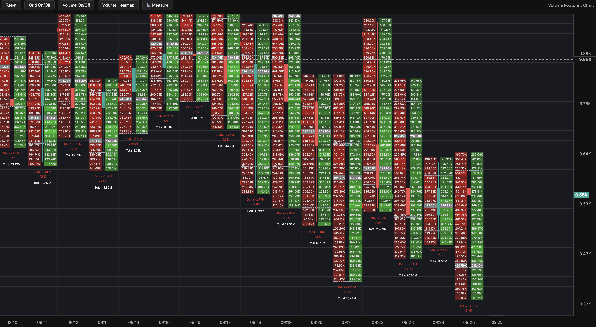

# Bitchart - Volume Footprint Chart Library

A modular, high-performance charting library for displaying volume footprint data with advanced interactions, volume heatmaps.



## 🚀 Quick Start

```bash
npm install
npm run build
```

Then include `dist/index.js` in your HTML:

```html
<script src="path/to/bitchart/dist/index.js"></script>
<script>
  const container = document.getElementById('chart-container');

  // Create chart with volume heatmap enabled
  const chart = new bitchart.Chart(container, {
    width: 800,
    height: 600,
    showVolumeFootprint: true,
    showVolumeHeatmap: true,
    volumeHeatmapDynamic: true  // Dynamic heatmap updates with zoom/pan
  });

  // Set candle data with footprint information
  chart.setData(candleData);
</script>
```

## ✨ Features

- **Volume Footprint Charts**: Display buy/sell volumes at each price level
- **Volume Heatmap**: Visual overlay showing aggregated volume concentrations (Dynamic/Static modes)
- **Interactive Toolbar**: Reset zoom, toggle grid, volume display, heatmap, and measurement tools
- **Advanced Interactions**: Smooth zoom, pan, and measurement tools
- **Customizable Themes**: Full color scheme customization
- **High Performance**: Optimized canvas rendering for large datasets
- **Modular Architecture**: Easy to extend and customize

## 📁 Project Structure

```
bitchart/
├── src/
│   ├── api/           # Public API layer
│   │   ├── create-chart.ts      # Chart factory
│   │   └── ichart-api.ts        # Chart interfaces
│   ├── chart.ts       # Core chart orchestrator
│   ├── drawing.ts     # Canvas rendering engine
│   ├── drawing/       # Specialized drawing modules
│   │   ├── footprint.ts         # Volume footprint rendering
│   │   ├── grid.ts              # Grid and bounds
│   │   ├── scales.ts            # Axis labels
│   │   ├── crosshair.ts         # Crosshair and price labels
│   │   └── measure.ts           # Measurement tools
│   ├── interactions.ts # Mouse/keyboard event handling
│   ├── scales.ts      # Coordinate transformations
│   ├── helpers/       # Utility functions
│   │   └── utils.ts             # Volume calculations
│   ├── styles.css     # Chart styling
│   ├── index.ts       # Library exports
│   └── types.ts       # TypeScript definitions
├── dist/              # Built library
├── media/             # Screenshots and assets
├── example.html       # Working demo
├── README.md          # This file
└── package.json       # Dependencies and scripts
```

## 🛠️ Toolbar Features

The chart includes a comprehensive toolbar with the following controls:

- **Reset**: Reset zoom and pan to show the latest data
- **Grid On/Off**: Toggle background grid lines
- **Volume On/Off**: Show/hide volume footprint data
- **Volume Heatmap**: Dropdown menu with options:
  - **Dynamic**: Heatmap updates based on visible candles (default)
  - **Static**: Heatmap uses all available data
  - **Off**: Disable volume heatmap
- **📐 Measure**: Interactive measurement tool for price/time analysis

## 🏗️ Architecture Overview

### Core Components

#### 1. **Chart Core** (`src/chart.ts`)
- **Purpose**: Main orchestrator managing the chart lifecycle
- **Responsibilities**:
  - Canvas setup and toolbar creation
  - Component initialization (scales, drawing, interactions)
  - Data management and updates
  - Event binding and cleanup
- **When to Edit**: For major architectural changes or new component integration

#### 2. **Drawing Engine** (`src/drawing.ts`)
- **Purpose**: Handles all canvas rendering operations
- **Key Methods**:
  - `drawAll()`: Main render loop
  - `drawChart()`: Candles and footprints
  - `drawVolumeHeatmap()`: Volume concentration overlay
  - `drawGrid()`: Background grid
  - `drawScales()`: Axes and labels
- **When to Edit**: For visual changes, new chart elements, or rendering optimizations

#### 3. **Interactions** (`src/interactions.ts`)
- **Purpose**: Manages user input (mouse, keyboard, touch)
- **Key Methods**:
  - `handleWheel()`: Zoom and scroll
  - `handlePointerDown()`: Drag/pan and measurement
  - `setMeasureMode()`: Toggle measurement tool
- **When to Edit**: For new interaction modes or changing zoom/pan behavior

#### 4. **Scales** (`src/scales.ts`)
- **Purpose**: Mathematical transformations between data and screen coordinates
- **Key Methods**:
  - `priceToY()`: Convert price to Y coordinate
  - `indexToX()`: Convert time index to X coordinate
  - `scaledSpacing()`: Zoom-adjusted spacing
- **When to Edit**: For coordinate system changes or new scaling logic

#### 5. **Drawing Modules** (`src/drawing/`)
- **Purpose**: Specialized rendering functions
- **Modules**:
  - `footprint.ts`: Volume footprint boxes, VAH/VAL lines, delta labels
  - `grid.ts`: Grid lines and chart bounds
  - `scales.ts`: Price/time axis labels
  - `crosshair.ts`: Crosshair and current price display
  - `measure.ts`: Measurement rectangle rendering

#### 6. **Styling** (`src/styles.css`)
- **Purpose**: CSS styling for toolbar and container elements
- **When to Edit**: For UI theme changes or layout adjustments

## 🔧 Configuration Options

```typescript
interface VFCOptions {
  width?: number;                    // Chart width in pixels
  height?: number;                   // Chart height in pixels
  showGrid?: boolean;                // Display background grid (default: true)
  showBounds?: boolean;              // Show chart boundary outlines (default: false)
  showVolumeFootprint?: boolean;     // Display volume footprint data (default: true)
  showVolumeHeatmap?: boolean;       // Display volume heatmap overlay (default: false)
  volumeHeatmapDynamic?: boolean;    // Dynamic heatmap updates with zoom/pan (default: true)
  tickSize?: number;                 // Price tick size for footprints (default: 10)
  initialZoomX?: number;             // Initial horizontal zoom (default: 0.55)
  initialZoomY?: number;             // Initial vertical zoom (default: 0.55)
  margin?: {                         // Chart margins
    top: number;
    bottom: number;
    left: number;
    right: number;
  };
  theme?: VFCTheme;                  // Color theme customization
}
```

### Volume Heatmap Modes

- **Dynamic Mode**: Heatmap recalculates based on currently visible candles, updating as you zoom and pan
- **Static Mode**: Heatmap uses all available data, providing consistent visualization regardless of zoom level

### Customization Examples

#### Custom Theme
```typescript
const chart = new bitchart.Chart(container, {
  theme: {
    background: '#1a1a1a',
    candleBull: '#00ff88',
    candleBear: '#ff4444',
    volumeBuyOpacity: 0.4,
    volumeSellOpacity: 0.4,
    vahValColor: '#ffaa00'
  }
});
```

#### Enable All Features
```typescript
const chart = new bitchart.Chart(container, {
  showVolumeFootprint: true,
  showVolumeHeatmap: true,
  volumeHeatmapDynamic: true,
  showGrid: true
});
```

## 🎨 Styling

The library uses CSS custom properties for theming:

```css
.vfc-container {
  --background: #111;
  --text-color: #eee;
  --grid-color: #333;
}
```

## 📊 Data Format

```typescript
interface CandleData {
  time: string;        // ISO timestamp (e.g., "2024-01-01T12:00:00.000Z")
  open: number;        // Opening price
  high: number;        // Highest price
  low: number;         // Lowest price
  close: number;       // Closing price
  footprint: FootprintLevel[]; // Volume data at each price level
}

interface FootprintLevel {
  price: number;       // Price level (must be multiple of tickSize)
  buy: number;         // Buy volume at this price level
  sell: number;        // Sell volume at this price level
}
```

### Sample Data Structure

```javascript
const candleData = [
  {
    time: "2024-01-01T12:00:00.000Z",
    open: 50000,
    high: 50200,
    low: 49900,
    close: 50100,
    footprint: [
      { price: 49900, buy: 150, sell: 200 },
      { price: 50000, buy: 300, sell: 250 },
      { price: 50100, buy: 400, sell: 180 },
      { price: 50200, buy: 220, sell: 350 }
    ]
  }
  // ... more candles
];
```

## 🔄 Build System

```bash
npm run build    # Production build
npm run dev      # Development with watch mode
```

The build outputs UMD format for browser compatibility.

## 🐛 Debugging

Enable debug logging by modifying `chart.ts`:

```typescript
console.log('Chart state:', this.view);
console.log('Data length:', this.data.length);
```

## 🚀 Performance Tips

1. **Large datasets**: Implement data virtualization in `chart.ts`
2. **Smooth animations**: Use `requestAnimationFrame` for custom animations
3. **Memory management**: Clean up event listeners in `destroy()`

## 📝 API Reference

### Chart API
```typescript
const chart = bitchart.createChart(container, options);

chart.addVolumeFootprintSeries(options): VolumeFootprintSeries
chart.applyOptions(options): void
chart.resize(width, height): void
chart.destroy(): void
```

### Series API
```typescript
const series = chart.addVolumeFootprintSeries(options);

series.setData(data: CandleData[]): void
series.updateData(data: CandleData[]): void
series.applyOptions(options): void
```

## 🤝 Contributing

Welcome to Bitchart! We're excited to have you contribute to this volume footprint charting library.

### Getting Started

1. **Fork** the repository on GitHub
2. **Clone** your fork locally
3. **Install** dependencies: `npm install`
4. **Create** a feature branch: `git checkout -b feature/your-feature-name`
5. **Make** your changes and test with `npm run build`
6. **Submit** a pull request with a clear description

### Development Guidelines

- **Code Style**: Follow TypeScript best practices
- **Testing**: Test your changes with the included `example.html`
- **Documentation**: Update README.md for any new features
- **Performance**: Consider performance implications for large datasets
- **Compatibility**: Ensure changes work across modern browsers

### Contact

For questions, suggestions, or collaboration opportunities:
- **GitHub**: [@sami_aldkheel](https://github.com/sami_aldkheel)
- **Email**: Contact through GitHub or project issues

## 📄 License

This project is free for personal and non-commercial use. For commercial/SaaS projects, please contact the author first to discuss licensing terms.

**Author**: Sami Aldkheel X:(@sami_aldkheel)